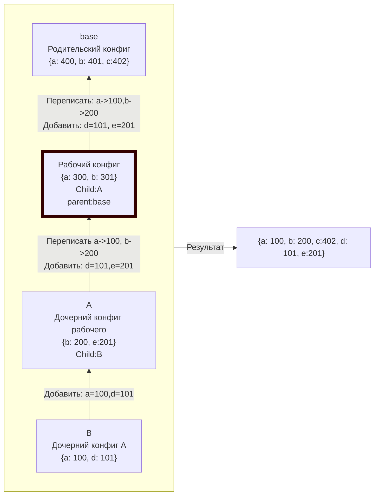

# Tuner

[](https://deno.land/x/tuner)

Tuner - модуль для управления конфигурациями проекта. Данные конфигурации описываются в виде **.ts** файла с экспортируемым объектом, который содержит перечисление _env_ переменных и полей конфига. Конфиги могут образовывать иерархию, наследуясь от родительских и перезаписываясь дочерними.

---

## Оглавление

## Простейший конфиг

Минимально конфиг может быть описан так:

```tsx
// config/myConfig.tuner.ts
import Tuner from 'https://deno.land/x/tuner/mod.ts';
export default Tuner.tune(
  {
    config: {
      field1: 'value1',
      field2: 100,
      field3: true,
      field4: ['минималистично', 'удобно', 'не правда ли?'],
    },
  },
);
```

> Функция _tune_ заботливо подскажет структуру ожидаемого объекта

Загрузка конфига и использование происходит так:

```tsx
// main.ts
import Tuner from 'https://deno.land/x/tuner/mod.ts';
const cfg = await Tuner.use.loadConfig();
console.log(cfg.config.field2); // 100
```

__При запуске обязательно наличие _env_ переменной _config_, ее значение - название файла конфига до _.tuner.ts,__ в данном примере это myConfig._

```bash
config=myConfig deno run --allow-all main.ts
```

## Конфиг с описанием env-переменных

В Tuner имеется возможность описать типы переменных окружения и поведения при их отсутствии:

- значение по умолчанию
- завершение процесса
- генерация исключения
- вычисление на лету

Например, так:

```tsx
// config/myConfig.tuner.ts
import Tuner from 'https://deno.land/x/tuner/mod.ts';
export default Tuner.tune(
  {
    env: {
      // Использовать Значение по умолчанию
      env1: Tuner.Env.getString.orDefault('defalut value1'),
      env2: Tuner.Env.getNumber.orDefault(100),
      env3: Tuner.Env.getBoolean.orDefault(true),
      // Проигнорировать отсуствие переменной
      env4: Tuner.Env.getString.orNothing(),
      env5: Tuner.Env.getNumber.orNothing(),
      env6: Tuner.Env.getBoolean.orNothing(),
      // Завершенить процесс
      env7: Tuner.Env.getString.orExit(
        'сообщение об ошибке, необязательно',
      ),
      env8: Tuner.Env.getNumber.orExit(
        'выведет в консоль перед выходом',
      ),
      env9: Tuner.Env.getBoolean.orExit(),
      // Сгенерировать исключение
      env10: Tuner.Env.getString.orThrow(new Error('ошибка')),
      env11: Tuner.Env.getNumber.orThrow(new Error()),
      env12: Tuner.Env.getBoolean.orThrow(new Error()),
      // Вычисленить данных по переданному колбэку
      //(может быть асинхронным, если данные нужно получить с диска или удаленно, например)
      env13: Tuner.Env.getString.orCompute(() => 'computed value1'),
      env14: Tuner.Env.getNumber.orAsyncCompute(() =>
        new Promise(() => 100)
      ),
    },
    config: {
      field1: 'value1',
      field2: 100,
      field3: true,
      field4: ['минималистично', 'удобно', 'не правда ли?'],
    },
  },
);
```

> **Разумеется, можно просто указать значение-примитив, вроде env1: 100**

## Объединение конфигов

Tuner позволяет “собрать” конфиг, используя другие конфиги, нужно только выстроить из них цепочку:

- Текущий конфиг дополнится всеми полями родительского, при этом сохранит свои значения
- Текущий конфиг дополнится всеми полями дочернего, при этом совпадающие поля будут переписаны значениями из дочернего конфига
- Значения-фукнции, используемые для описания env-переменных также подчиняются этим правилам



> При этом, например, конфигу В необязательно указывать А в качестве родительского.

Реализация:

```tsx
// config/develop.tuner.ts
import Tuner from 'https://deno.land/x/tuner/mod.ts';
export default Tuner.tune({
  child: Tuner.Load.local.configDir('a.tuner.ts'),
  parent: Tuner.Load.local.configDir('base.tuner.ts'),
  config: {
    a: 300,
    b: 301,
  },
});

//config/base.tuner.ts
import Tuner from 'https://deno.land/x/tuner/mod.ts';
export default Tuner.tune({
  config: { a: 400, b: 401, c: 402 },
});

//config/a.tuner.ts
import Tuner from 'https://deno.land/x/tuner/mod.ts';
export default Tuner.tune({
  child: Tuner.Load.local.configDir('b.tuner.ts'),
  config: {
    b: 200,
    e: 201,
  },
});

//config/b.tuner.ts
import Tuner from 'https://deno.land/x/tuner/mod.ts';
export default Tuner.tune({
  config: { a: 100, d: 101 },
});

//main.ts
import Tuner from 'https://deno.land/x/tuner/mod.ts';
const cfg = await Tuner.use.loadConfig();
console.log(cfg);
//{ config: { a: 100, b: 200, c: 402, e: 201, d: 101 }, env: {} }
```

_Tuner.Load_ предлагает локальный и удаленный вариант подключения конфига.

Tuner.Load.local

| Функция                   | Вернет объект конфига из файла по …                 |
| ------------------------- | --------------------------------------------------- |
| absolutePath(path:string) | …указанному полному пути до него                    |
| configDir(path:string)    | …пути, относительно директории с названием “config” |
| cwd(path:string)          | …относительному пути в директории проекта           |

---

Tuner.Load.remote

| Фукнция                                                         | Описание                                                                                                                    | Пример (пусть файл конфигурации лежит по адресу http://some_server/b.tuner.ts)                       |
| --------------------------------------------------------------- | --------------------------------------------------------------------------------------------------------------------------- | ---------------------------------------------------------------------------------------------------- |
| import(path:string)                                             | Работает, как обычный импорт                                                                                                | child: Tuner.Load.remote.import(”http://some_server/b.tuner.ts”)                                     |
| callbackReturnModule(cb: () ⇒ Promise<{default: ITunerConfig}>) | Принимает колбэк, который вернет промис с импортируемым модулем                                                             | child: Tuner.Load.remote.callbackReturnModule(() ⇒ import(”http://some_server/b.tuner.ts”))          |
| callbackReturnString((cb: () => Promise<string>))               | Принимает колбэк, который вернет промис с текстом модуля в виде строки (забираем код конфига из форм, блоков в Notion и тд) | child: Tuner.Load.remote.callbackReturnString(() ⇒ someFetchingFunctionStringReturned(options: {…})) |

Кроме того, _Tuner.Load.remote_ имеет встроенные интеграции с различными сервисами через _Tuner.Load.remote.providers:_

- notion(key:string, blockUrl:string) - отдаем ключ авторизации(_Tuner.getEnv_ поможет найти env-переменную в окружении или .env файле) и ссылку на блок в Notion, в котором описан модуль конфигурации
- github(key: string, owner: string, repo: string, filePath: string) - ключ, ник держателя репо, название репо и путь до файла.

## Генерация схемы конфига

Для удобной работы с объектом конфигурации во время разработки рекомендуется сгенерировать тип объекта.

_Tuner.use.generateSchema(**obj**_: ObjectType, _**variableName**_: string, _**filePath**_: string) сформирует файл по пути _**filePath**_ со схемой объекта _**obj**_ и экспортирует тип с названием _**variableName**_, переведя первую букву в заглавный регистр.

```tsx
const cfg = await Tuner.use.loadConfig();
Tuner.use.generateSchema(
  cfg,
  'config',
  'config/configSchema.ts',
);
```

Файл config/configSchema.ts

```tsx
import { z } from 'https://deno.land/x/zod/mod.ts';

export const configSchema = z.object({
  config: z.object({
    a: z.number(),
    b: z.number(),
    c: z.number(),
    e: z.number(),
    d: z.number(),
  }),
  env: z.object({}),
});

export type Config = z.infer<typeof configSchema>;

//├─ config
//│  ├─ a
//│  ├─ b
//│  ├─ c
//│  ├─ e
//│  └─ d
//└─ env
//
```
